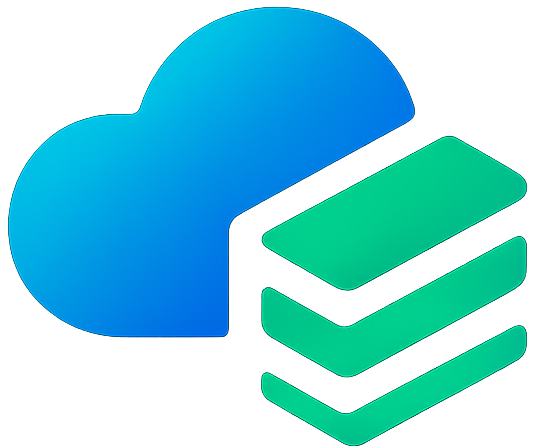
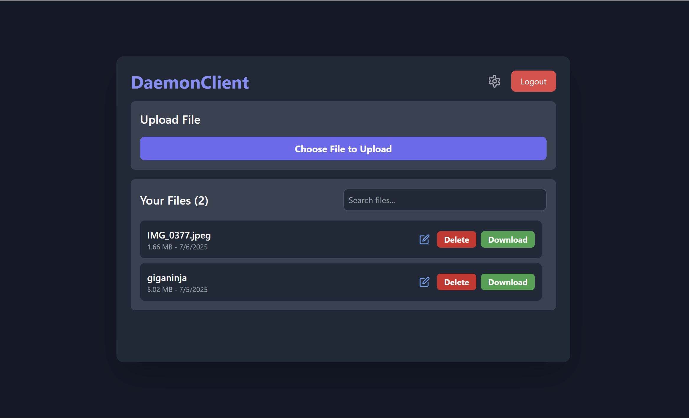
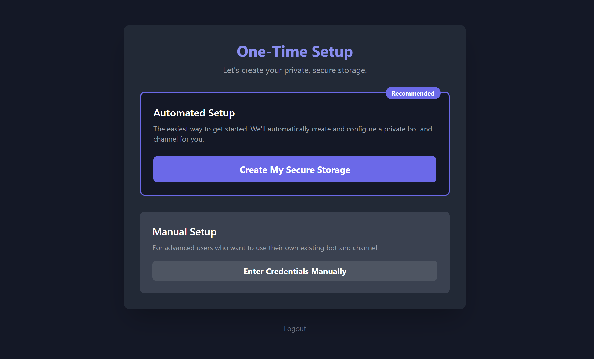

<p align="center">
  
</p>

<h1 align="center">DaemonClient</h1>

<p align="center">
  <strong>Your Files. Your Cloud. Your Control.</strong><br>
  <em>A zero-knowledge cloud storage platform built on Telegram's infinite infrastructure.</em>
</p>

<p align="center">
  <a href="https://daemonclient-c0625.web.app"></a>
  <a href="#-get-started"></a>
</p>

<p align="center">
  
  
  
  
</p>

---

## 🚀 What is DaemonClient?

DaemonClient is a **secure, open-source cloud storage platform** that transforms your Telegram account into an infinite, zero-cost file vault. Unlike traditional cloud services that rent you space, we give you the tools to **own your infrastructure**.

<table>
<tr>
<td width="50%">

### ✨ Key Features

- 🔐 **Zero-Knowledge Architecture** — Files encrypted with AES-256-GCM before leaving your device
- ♾️ **Unlimited Storage** — Leverage Telegram's generous file limits at zero cost
- ⚡ **Blazing Fast** — Concurrent chunking with parallel uploads/downloads
- 🤖 **One-Click Setup** — Automated bot & channel creation, ownership transferred to you
- 💻 **Multi-Platform** — Web app + CLI for power users

</td>
<td width="50%">

### 🔒 Security Model

```
┌─────────────────────────────────┐
│  Your Device (Client-Side)      │
│  ┌───────────────────────────┐  │
│  │ AES-256-GCM Encryption    │  │
│  │ PBKDF2 Key Derivation     │  │
│  │ Keys held in memory only  │  │
│  └───────────────────────────┘  │
└─────────────────────────────────┘
            │ encrypted
            ▼
┌─────────────────────────────────┐
│  Telegram (Storage Backend)     │
│  Only sees encrypted noise      │
└─────────────────────────────────┘
```

</td>
</tr>
</table>

---

## 🏗️ Architecture

<p align="center">
  
</p>

**How It Works:**

1. **Automated Provisioning** — Python backend creates your personal Telegram bot + private channel
2. **Ownership Transfer** — Full control is cryptographically transferred to you; developers cannot access your data
3. **Client-Side Encryption** — Files are encrypted with AES-256-GCM before upload
4. **Atomic Chunking** — Large files split into 19MB encrypted shards for parallel transfer
5. **Ephemeral Keys** — Encryption keys exist only in memory, destroyed on logout

---

## 📦 Get Started

### 🌐 Web App (Recommended)

The fastest way to start. No installation required.

<p align="center">
  <a href="https://daemonclient-c0625.web.app">
    
  </a>
</p>

### 💻 Daemon CLI

For power users. Script your uploads, automate backups.

```bash
# Install globally
npm install -g daemonclient-cli

# Authenticate
daemon login

# Upload a file
daemon upload secret_plans.pdf

# List your files
daemon list
```

---

## 🛠️ Tech Stack

| Layer | Technology |
|-------|------------|
| **Frontend** | React, Vite, Tailwind CSS |
| **Backend (Setup)** | Python, Flask, Telethon |
| **Backend (Proxy)** | TypeScript, Cloudflare Workers |
| **Database & Auth** | Firebase (Firestore, Authentication) |
| **Encryption** | Web Crypto API (AES-256-GCM, PBKDF2) |
| **Infrastructure** | Telegram Bot API |

---

## 🔧 Self-Hosting

<details>
<summary><strong>For Developers: Deploy Your Own Instance</strong></summary>
<br>

```bash
# Clone the repository
git clone https://github.com/myrosama/DaemonClient.git
cd DaemonClient
```

**1. Frontend** — Deploy `/frontend` to any static host (Vercel, Netlify, Firebase)

**2. Download Proxy** — Deploy `/daemonclient-proxy` to Cloudflare Workers

**3. Backend Server** — Deploy `/backend-server` to an always-on host (Render, Railway)
   - Requires Telegram userbot credentials in `.env`
   - See `.env.example` for required variables

**4. Firebase** — Create a Firebase project for auth + Firestore

</details>

---

## 📸 Screenshots

<details>
<summary><strong>View Screenshots</strong></summary>
<br>
<p align="center">
  
  <br><em>File Dashboard — Upload, download, and manage your encrypted files</em>
  <br><br>
  
  <br><em>One-Click Setup — Automated bot creation and ownership transfer</em>
</p>
</details>

---

## 🗺️ Roadmap

- [x] Web Dashboard with folder management
- [x] CLI tool for power users
- [x] Zero-knowledge encryption (AES-256-GCM)
- [ ] 🖥️ **Daemon Sync** — Desktop app with auto-sync folder
- [ ] 📱 **Mobile Apps** — iOS & Android native apps
- [ ] 📂 **FUSE Mount** — Browse cloud files as a virtual drive

---

## ❤️ Support

Enjoying DaemonClient? Help keep the servers running:

<p align="center">
  <a href="https://ko-fi.com/myrosama"></a>
</p>

---

## 📜 License

MIT License — See [LICENSE](LICENSE) for details.

---

<p align="center">
  <strong>Built with 💜 by <a href="https://github.com/myrosama">@myrosama</a></strong>
  <br>
  <em>Based on <a href="https://github.com/myrosama/telegram-cloud-backup">telegram-cloud-backup</a></em>
</p>
