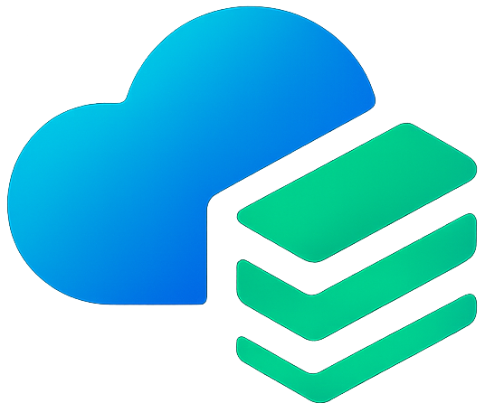
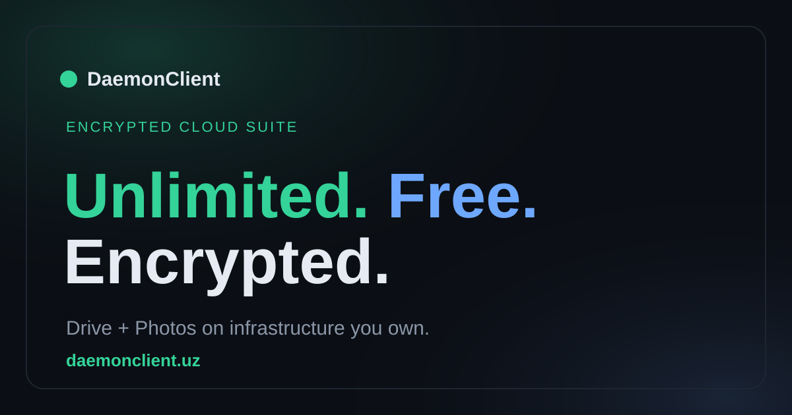
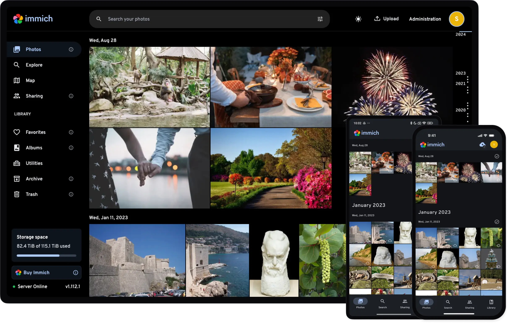
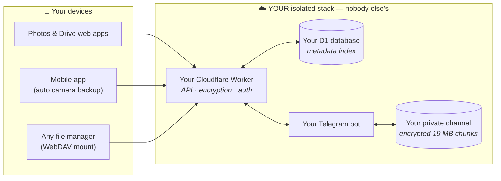
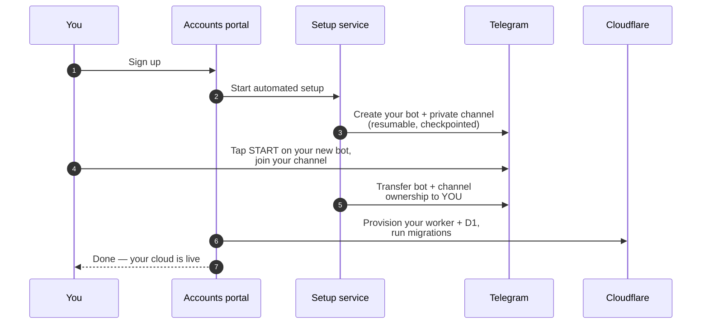

  

<h1 align="center">DaemonClient</h1>

  <strong>Free. Unlimited. Encrypted.</strong> 
  <em>Your own private cloud — built on infrastructure you own, at $0/month.</em>

  
  
  

  
  
  
  
  

  

---

## What is DaemonClient?

Cloud storage is expensive, and you don't own any of it. DaemonClient flips that: it combines two services with famously generous free tiers — **Telegram** (unlimited file storage through bots and channels) and **Cloudflare Workers** (serverless compute + D1 database) — into a personal cloud platform where **every single user gets their own isolated stack**:

- **your own** Telegram bot and private storage channel — ownership is *actually transferred to you*
- **your own** Cloudflare Worker and D1 database — your API, your index, nobody else's traffic
- **your own** encryption — files are encrypted before they ever reach Telegram

There is no shared file server. There is no operator database holding everyone's photos. When you upload a photo, it travels to *your* worker, gets encrypted, and lands in *your* Telegram channel as chunks that only your stack can read back.

| Principle | How it's real, not marketing |
|---|---|
| 🆓 **Zero cost** | Telegram stores the bytes, Cloudflare runs the compute, Firebase's free tier handles auth. There is nothing to pay for and no premium tier. |
| ♾️ **Unlimited** | Telegram channels have no storage cap. Files are chunked at 19 MB (the Bot API's download limit) and stitched back together on the fly. |
| 🔐 **Encrypted** | AES-256-GCM. Drive encrypts **in your browser** (true zero-knowledge — the server never sees plaintext). Photos encrypts on **your own isolated worker** before anything touches Telegram. |
| 🔑 **Owned** | The setup flow creates your bot and channel, then transfers ownership of both **to your Telegram account** via BotFather. Verify it yourself: open BotFather — the bot is listed as yours. |
| 🧱 **Isolated** | One worker + one database + one bot per user. A bug, outage, or rate limit in one user's stack cannot touch another's. |

---

## The products

| Product | URL | What it is |
|---|---|---|
| 📸 **DaemonClient Photos** | [photos.daemonclient.uz](https://photos.daemonclient.uz) | A full Google-Photos-style gallery — timeline, albums, favorites, EXIF + map view, live photos, videos, trash, zip downloads. Works with the mobile app for automatic camera backup. |
| 📁 **DaemonClient Drive** | [drive.daemonclient.uz](https://drive.daemonclient.uz) | General file storage with folders, previews, and true client-side encryption — plus a **WebDAV endpoint**, so your cloud mounts as a real drive in Windows Explorer, macOS Finder, or any file manager. |
| 👤 **Accounts** | [accounts.daemonclient.uz](https://accounts.daemonclient.uz) | One account for everything: the guided setup that builds your bot, channel, and worker, plus your dashboard, profile, and security controls. |
| 🌐 **Landing** | [daemonclient.uz](https://daemonclient.uz) | The front door. |

  

---

## How it works

```mermaid
flowchart LR
    subgraph Clients["📱 Your devices"]
        WEB["Photos & Drive web apps"]
        APP["Mobile app<br/>(auto camera backup)"]
        DAV["Any file manager<br/>(WebDAV mount)"]
    end

    subgraph Stack["☁️ YOUR isolated stack — nobody else's"]
        W["Your Cloudflare Worker<br/><i>API · encryption · auth</i>"]
        D1[("Your D1 database<br/><i>metadata index</i>")]
        BOT["Your Telegram bot"]
        CH[("Your private channel<br/><i>encrypted 19 MB chunks</i>")]
    end

    WEB --> W
    APP --> W
    DAV --> W
    W <--> D1
    W <--> BOT
    BOT <--> CH
```

Every user's data path is fully vertical: device → your worker → your bot → your channel. The only shared components are the **control plane** — the accounts portal, the login service, and the deployment service that provisions per-user workers and ships them code updates. None of them sit in the path of your file bytes.

### Onboarding: from zero to your own cloud in minutes

```mermaid
sequenceDiagram
    autonumber
    participant U as You
    participant P as Accounts portal
    participant S as Setup service
    participant TG as Telegram
    participant CF as Cloudflare

    U->>P: Sign up
    P->>S: Start automated setup
    S->>TG: Create your bot + private channel<br/>(resumable, checkpointed)
    U->>TG: Tap START on your new bot,<br/>join your channel
    S->>TG: Transfer bot + channel<br/>ownership to YOU
    P->>CF: Provision your worker + D1,<br/>run migrations
    P-->>U: Done — your cloud is live
```

The setup is fully automated but ends with **you owning everything**. Prefer manual control? The portal also accepts a bot token and channel ID you created yourself.

---

## Feature highlights

### 📸 Photos
- Timeline with month buckets, thumbhash blur placeholders, favorites, archive, trash
- Albums, EXIF metadata (camera, lens, exposure) and a **map view** from GPS data
- **Live Photos** — the still and its motion video pair up just like on your phone
- Video playback with on-the-fly multi-chunk stitching and HTTP range support
- Mobile app with automatic background camera backup (an [Immich](https://github.com/immich-app/immich) fork)
- Server-side SHA-1 checksums so re-installs and re-uploads **deduplicate instead of duplicating**
- Zip archive downloads of any selection
- Self-healing background jobs: missing checksums, missing EXIF, and broken thumbnails repair themselves quietly while you use the app

### 📁 Drive
- Folders, uploads of any size (19 MB chunking), previews, search
- **True zero-knowledge encryption**: AES-256-GCM keys derived in your browser — the worker only ever stores ciphertext
- **WebDAV**: mount your encrypted cloud as a normal drive on desktop; the worker decrypts transparently on the way out
- Direct-from-Telegram downloads in the browser via a service worker — on supported paths, file bytes skip the server entirely

### 🛠 Platform
- Long-lived sessions (no weekly re-logins); token refresh handled server-side
- Per-user workers **auto-update**: when a fix ships, your worker pulls the new build on your next login or dashboard visit — a fleet of single-tenant APIs that stays current with zero user effort
- Free-tier engineering throughout: request queues with byte budgets, subrequest-bounded background jobs, edge caching of decrypted chunks, and streamed responses that never hold more than ~2 chunks in memory

---

## Security model, honestly

- **Drive files** are encrypted *client-side* in your browser before upload. Zero-knowledge: neither the worker nor Telegram ever sees plaintext.
- **Photos** are encrypted on *your own* single-tenant worker before reaching Telegram — this is what enables server features like thumbnails, EXIF extraction, and deduplication. The tradeoff is deliberate, documented, and confined to infrastructure that serves only you. A fully client-side mode exists for the web uploader.
- **Your bytes never transit shared machines.** This is a hard rule enforced in code: optional heavy-compute features (like HEIC conversion) run only against a *per-user* processor URL from your own config — never a shared operator box.
- **Setup endpoints are authenticated** with your Firebase identity; per-user Firestore rules isolate every user's configuration; the bot token that controls your channel lives in *your* config, readable only by you.
- Found something? Security reports are very welcome — open an issue or contact the maintainer.

---

## Repository map

This is a monorepo containing the whole platform:

| Directory | What lives there |
|---|---|
| `immich-api-shim/` | ⭐ The per-user worker: the entire Photos + Drive API — encryption, Telegram chunk I/O, D1 access, background heal jobs |
| `deployment-service/` | Provisions per-user workers + D1, embeds the worker bundle, powers fleet auto-update |
| `accounts-portal/` | React portal: signup, guided Telegram/Cloudflare setup, dashboard |
| `auth-worker/` | Cross-domain session service (`auth.daemonclient.uz`) |
| `backend-server/` | Setup automation (creates + transfers your bot/channel) for the managed flavor |
| `immich/` | The Immich fork: Photos web app (`web/`) + mobile app (`mobile/`) |
| `drive/` | The Drive web app |
| `daemonclient-site/` | The landing page |
| `docs/` | Architecture notes and roadmaps — start with `docs/roadmap/` |

*(A few other directories are earlier experiments queued for cleanup — see the roadmap.)*

---

## Built on the shoulders of

- [**Immich**](https://github.com/immich-app/immich) — the outstanding self-hosted photo platform our Photos apps are forked from. If you want a traditional self-hosted gallery on your own hardware, go star it.
- **Telegram Bot API** — the storage layer. DaemonClient is an independent project, not affiliated with or endorsed by Telegram.
- **Cloudflare Workers + D1** — the compute layer that makes one-stack-per-user architecture free.

## Fair warnings

- DaemonClient is in **beta**. It's used daily and treated with production care, but expect rough edges.
- Your storage lives in your Telegram channel and is subject to Telegram's Terms of Service. Keep the bot in the channel and don't touch the channel's messages — they *are* your data.
- Very large videos (>100 MB) can't yet be uploaded from mobile (a Cloudflare request-size limit; on the roadmap).

---

<h2 align="center">🚀 Open-source self-hosting — coming soon</h2>

Everything above runs today as a managed service. The next chapter is the one we're most excited about: 
a fully <strong>self-hostable</strong> DaemonClient — clone the repo, run <strong>one script</strong>, and the entire ecosystem 
(worker, database, bot, web apps, media processor) deploys onto <strong>your own accounts</strong>, 
with built-in update notifications when new versions ship.

<strong>Star ⭐ and watch 👁 the repo to catch the release.</strong>

  Your files. Your cloud. Your control.

