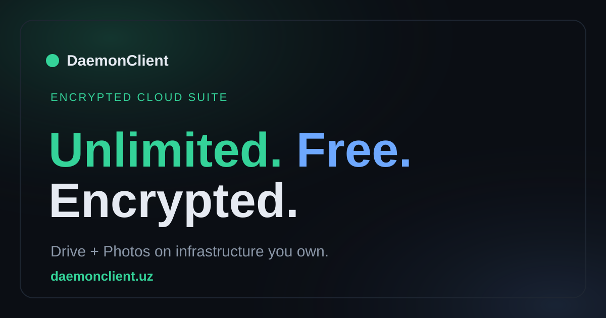
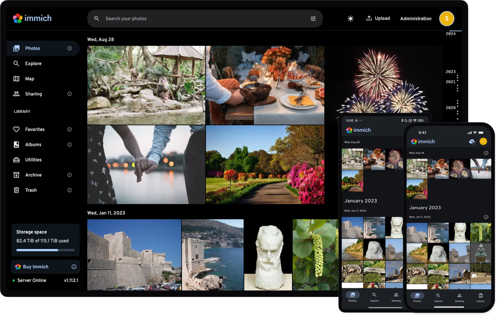
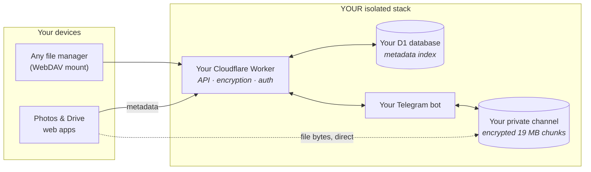

<p align="center">
  
</p>

<h1 align="center">DaemonClient</h1>

<p align="center">
  <strong>Your own private cloud. Unlimited. Encrypted. $0/month.</strong><br>
  <em>Photos and Drive, running entirely on free tiers you control.</em>
</p>

<p align="center">
  <a href="https://daemonclient.uz"></a>
  <a href="https://photos.daemonclient.uz"></a>
  <a href="https://drive.daemonclient.uz"></a>
</p>

<p align="center">
  
  
  
  
  
  
</p>

<p align="center">
  
</p>

---

## What this is

Cloud storage is expensive and you don't own any of it. DaemonClient combines
two services with unusually generous free tiers — **Telegram** (unlimited file
storage through bots and channels) and **Cloudflare Workers** (serverless
compute plus a D1 database) — into a personal cloud where **every user gets
their own isolated stack**:

- **your own** Telegram bot and private channel — ownership actually transferred to you
- **your own** Cloudflare Worker and D1 database — your API, your index, nobody else's traffic
- **your own** encryption keys — files are encrypted before they ever reach Telegram

There is no shared file server and no operator database holding everyone's
photos. A photo you upload travels to *your* worker, gets encrypted, and lands
in *your* Telegram channel as chunks only your stack can read back.

**You can run the whole thing yourself.** One command builds a complete install
on your own Telegram, Cloudflare and Firebase accounts, with nothing pointing
back at us — see [Self-hosting](#self-hosting).

---

## Try it

| | | |
|---|---|---|
| 📸 **Photos** | [photos.daemonclient.uz](https://photos.daemonclient.uz) | Timeline, albums, favourites, EXIF and map view, live photos, video, trash, zip downloads |
| 📁 **Drive** | [drive.daemonclient.uz](https://drive.daemonclient.uz) | Folders, previews, client-side encryption, and a WebDAV mount |
| 👤 **Accounts** | [accounts.daemonclient.uz](https://accounts.daemonclient.uz) | One account for both, plus the guided setup and your dashboard |
| 📖 **Docs** | [docs/](docs/) | Architecture, API, self-hosting |

<p align="center">
  
</p>

---

## How it works


```mermaid
flowchart LR
    subgraph Clients["Your devices"]
        WEB["Photos & Drive<br/>web apps"]
        DAV["Any file manager<br/>(WebDAV mount)"]
    end

    subgraph Stack["YOUR isolated stack"]
        W["Your Cloudflare Worker<br/><i>API · encryption · auth</i>"]
        D1[("Your D1 database<br/><i>metadata index</i>")]
        BOT["Your Telegram bot"]
        CH[("Your private channel<br/><i>encrypted 19 MB chunks</i>")]
    end

    WEB -->|metadata| W
    DAV --> W
    W <--> D1
    W <--> BOT
    WEB -.->|file bytes, direct| CH
    BOT <--> CH
```

Note the dotted line: **on the web, file bytes never touch the worker.** The
browser chunks and encrypts a file itself and sends it straight to Telegram,
and a service worker reads it back the same way. The worker only ever handles
the index. That is what keeps a photo library inside a free tier that allows
100,000 requests a day.

The only shared components are the control plane — the accounts portal, the
login endpoint, and the service that provisions per-user workers. None of them
sit in the path of your bytes.

**Three numbers explain most of the design:**

| | | |
|---|---|---|
| **19 MB** | Telegram won't let a bot *download* a file bigger than 20 MB — uploads can be larger, which is a trap. Files are chunked below the cap and never merged. |
| **10 ms** | The CPU a free Cloudflare Worker gets per request. No image decoding, no transcoding, no big buffers. |
| **50** | External subrequests per invocation. A 50-chunk file is already at the ceiling, so background jobs run one at a time. |

The full explanation is in [docs/ARCHITECTURE.md](docs/ARCHITECTURE.md).

---

## Self-hosting

```bash
git clone https://github.com/myrosama/DaemonClient.git
cd DaemonClient/immich-api-shim && npm install && cd ..
node selfhost/bin/daemonclient.mjs setup
```

About ten minutes, most of it you clicking around in Telegram and Cloudflare.
Then `daemonclient web` builds and deploys the three web apps to your own
Firebase Hosting.

**A self-hosted install depends on nothing we run.** Not your files, not your
credentials, not a telemetry ping. The single outbound call to anything of ours
is an anonymous check of the public GitHub releases feed, which sends nothing
about your install and can be turned off. If this project disappears tomorrow,
your install keeps working: the files are in your Telegram channel, the index is
in your D1 database, and the code is in your clone under AGPL-3.0.

Full guide: **[docs/SELF_HOSTING.md](docs/SELF_HOSTING.md)**.

---

## What works, and what doesn't

Honesty is more useful than a feature list, so both columns:

### Working

**Photos** — timeline with month buckets and thumbhash placeholders, albums,
favourites, archive, trash, EXIF (camera, lens, exposure) with a map view from
GPS, live photos, video playback with range-aware multi-chunk streaming,
server-side SHA-1 so re-installs deduplicate instead of duplicating, zip
downloads, and background jobs that quietly repair missing checksums, EXIF and
thumbnails while you use the app.

**Drive** — folders, uploads of any size, previews, search, true zero-knowledge
encryption (keys derived in your browser; the worker only ever holds
ciphertext), and **WebDAV**, so your cloud mounts as a normal drive in Windows
Explorer, macOS Finder or any file manager.

**Platform** — long-lived sessions, one sign-in across all three apps, and
per-user workers that auto-update on your next login.

### Not working, or not there

| | |
|---|---|
| **Mobile apps** | A fork of the Immich app exists in `immich/mobile/` and is **not released**. It is not currently being worked on — the web comes first. See [Roadmap](docs/ROADMAP.md). |
| **Videos over 100 MB from mobile** | Cloudflare's request-body cap. Needs chunked upload in the app. Web uploads are unaffected — they bypass the worker entirely. |
| **HEIC thumbnails** | Blank unless you deploy the optional [`processor/`](processor). Workers cannot decode HEIC and Telegram won't thumbnail it. Every other format, video included, is fine. |
| **Face recognition, smart search, places** | Not implemented. They need ML this architecture has nowhere to run. The routes return correctly-shaped empty results rather than errors. |
| **Sharing between users** | Built and held pending a security review. One install, one owner, for now. |
| **`POST /api/sync/ack`** | Not implemented — every ack the mobile client sends is a no-op. |

More detail, including the four-times-duplicated storage code, is under
[known sharp edges](docs/ARCHITECTURE.md#known-sharp-edges).

---

## Security

- **Drive** is encrypted *client-side* in your browser. Zero-knowledge — neither the worker nor Telegram sees plaintext.
- **Photos** is encrypted on *your own* single-tenant worker, which is what makes thumbnails, EXIF and deduplication possible. A deliberate trade, confined to infrastructure serving one person.
- **Your bytes never transit shared machines.** Enforced in code: optional heavy compute (HEIC conversion) only ever calls a *per-user* processor URL from your own config.
- **One install, one owner**, enforced at the single authentication chokepoint rather than per route.

Found something? **Please report it privately** — see [SECURITY.md](SECURITY.md).
Past issues are listed there too, because they are the shape of thing worth
looking for.

---

## Repository map

| Directory | What lives there |
|---|---|
| [`immich-api-shim/`](immich-api-shim) | ⭐ The per-user worker: the entire Photos + Drive API — encryption, Telegram chunk I/O, D1, background repair |
| [`selfhost/`](selfhost) | The self-hosting CLI. Dependency-free, runs from a fresh clone |
| [`deployment-service/`](deployment-service) | Provisions per-user workers for the managed service and ships them updates |
| [`accounts-portal/`](accounts-portal) | Sign-up, the guided setup wizard, the dashboard |
| [`auth-worker/`](auth-worker) | Cross-subdomain session broker (managed service only) |
| [`immich/`](immich/FORK.md) | The Immich fork: Photos web app (`web/`) and the unreleased mobile app (`mobile/`) |
| [`drive/`](drive) | The Drive web app — not a fork |
| [`processor/`](processor) | Optional HEIC thumbnailer, deployed to each user's own Vercel |
| [`daemonclient-proxy/`](daemonclient-proxy) | CORS relay for the Telegram Bot API |
| [`schema/`](schema) | The D1 schema, defined once for both provisioners |
| [`daemonclient-site/`](daemonclient-site) | The landing page |
| [`docs-site/`](docs-site) | The documentation site |
| [`docs/`](docs) | Architecture, API reference, self-hosting guide |

Every directory has its own README explaining what it is and how to run it.

---

## Contributing

Start with [CONTRIBUTING.md](CONTRIBUTING.md) — it covers where things live, the
four hard constraints that explain most of the odd-looking code, and the
mistakes already made so you don't have to repeat them.

```bash
cd immich-api-shim
npm install
npm test          # 294 tests
npx tsc --noEmit
```

Please don't test against anyone else's deployment, including ours. Self-hosting
builds you a full stack in about ten minutes on free tiers; test there.

---

## Built on the shoulders of

- [**Immich**](https://github.com/immich-app/immich) — the excellent self-hosted photo platform our Photos apps are forked from. If you want a conventional gallery on your own hardware, go star it. See [immich/FORK.md](immich/FORK.md) for exactly what we changed.
- **Telegram Bot API** — the storage layer.
- **Cloudflare Workers + D1** — the compute layer that makes one-stack-per-user free.

## Fair warnings

- DaemonClient is in **beta**. It is used daily and treated with production care, but expect rough edges.
- Your storage lives in your Telegram channel and is subject to Telegram's Terms of Service. Keep the bot in the channel and don't touch the channel's messages — they *are* your data.
- Losing your encryption key means losing access to files already stored. There is no recovery path, by design.

## Licence

[AGPL-3.0-or-later](LICENSE). See [NOTICE](NOTICE) for attribution and
trademarks. DaemonClient is not affiliated with or endorsed by Telegram,
Cloudflare, Google, or the Immich project.

<p align="center">
  <sub>Your files. Your cloud. Your control.</sub>
</p>
