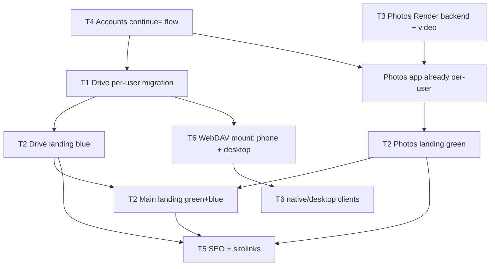

# DaemonClient — Program Roadmap & Tracking

> **This is the single source of truth for the multi-product initiative.**
> Read this first each session. Update the **Status Log** at the bottom after every
> work block (especially after a bug-fix detour) so we never lose the thread.
> Last updated: 2026-06-02.

---

## 1. Vision

DaemonClient is a **suite of zero-cost, end-to-end-encrypted, user-owned products**.
Every user runs the storage on **their own Cloudflare account** (Worker + D1) with
files encrypted in **their own Telegram** bot/channel. We never hold their bytes.
`accounts.daemonclient.uz` is the one central place that handles auth + provisions
each user's private infrastructure.

Products: **Drive** (files, like a private Google Drive) and **Photos** (like a
private Google Photos), plus more "coming soon." Each is the same per-user
architecture; only the front-end experience differs.

## 2. Products & Domains

| Product | Domain (current → target) | Color | Codebase | Landing page |
|---|---|---|---|---|
| Main / brand | `daemonclient.uz` | green + blue | `frontend/` (shared with Drive today) | **build** (showcase products) |
| Drive | `app.daemonclient.uz` → **decision: `drive.daemonclient.uz`?** | blue | `frontend/` | **build** (blue) |
| Photos | `photos.daemonclient.uz` | green | `immich/web/` | **build** (green) |
| Accounts | `accounts.daemonclient.uz` | neutral | `accounts-portal/` | none needed (show login/signup) |

## 3. Design language (designs produced via Claude's design tool from our prompts)

- **Main landing**: green **and** blue — the umbrella brand. Clear product showcase:
  "Drive" (blue card) and "Photos" (green card), plus "more soon." Clicking a product
  → that product's landing page.
- **Drive landing**: blue tone. Clear, smooth, **not** AI-generic. CTA → sign in /
  sign up (sign up goes to accounts portal, returns to Drive).
- **Photos landing**: green tone. Same structure.
- All three: SEO-perfect, fast, cohesive, human-designed feel.

## 4. Core architecture (already true for Photos; Drive must adopt it)

- Per-user **Cloudflare Worker** (`immich-api-shim`) + per-user **D1** + the user's
  **Telegram** storage. Files chunked (19 MB) + AES-GCM encrypted.
- **`deployment-service`** worker provisions per-user infra (uses the user's pasted
  Cloudflare API token) and force-updates shims. See [[project-photos-worker-update-and-cache]].
- Auth: session JWT carries `workerUrl`; the client routes **directly** to the
  user's worker (no central data-plane bottleneck). See [[project-int64-mobile-trap]]
  for the native-app strict-parse gotchas.
- `accounts.daemonclient.uz` = central signup/onboarding (Telegram + Cloudflare setup).

## 5. Tracks (sub-projects)

Each track is independent enough to spec + build on its own. Status: ⬜ todo ·
🟦 in progress · ✅ done · 🔬 researching.

### T1 — Drive migration: central/Firebase → per-user worker + D1  📋 planned
Keep `frontend/` design; copy into new `drive.daemonclient.uz` folder; replace
shared/central backend with the per-user worker + D1. **Research done — plan:**
- `frontend/` = React19/Vite7/Tailwind4 SPA, one 2626-line `App.jsx`. Old model:
  Firebase Auth + Firestore metadata + **browser→Telegram via shared public proxy
  with the bot token shipped to the browser** (security hole) + Render setup calls.
- **Reuse the user's existing per-user worker + D1.** Add `/api/drive/*` handlers
  (new `immich-api-shim/src/drive.ts`, dispatched in `index.ts`) + a **`files` table**
  (`id, ownerId, parentId, type[file|folder], fileName, fileSize, mimeType,
  telegramChunks JSON, encryptionMode, encrypted, uploadedAt, updatedAt`). Reuse
  `assets.ts` primitives (chunk/encrypt/`tgDownloadFile`/`paceSend`/`getEncryptionKey`).
  Add `D1Adapter` file methods.
- **Schema lives in TWO places — keep in lockstep:** new migration `1.2.0` in
  `immich-api-shim/src/migrations.ts` AND the inline `MIGRATION_SQL` in
  `deployment-service/src/index.ts:77`; bump `WORKER_VERSION` (`index.ts:16`);
  `/auto-update` propagates to existing users.
- Frontend: keep Firebase **Auth**, delete Firestore usage + `manifest-sync.js` +
  direct-Telegram `uploadFile/downloadFile/deleteTelegramMessages` + Render setup
  calls + plaintext-ZKE-password (`App.jsx:802,1066`) + dead `PhotoGalleryView`
  import (`App.jsx:10` — may break `vite build`, verify). Rewrite `public/sw.js` to
  the Photos `workerUrl`-routing pattern (drop `/tg-proxy/` + token).
- Add Drive origin to worker `ALLOWED_ORIGINS`.
- **Blocker → see T4:** signup `?continue=` doesn't exist yet.
- Future: WebDAV (`/dav/*`) → mount from phone file manager + desktop virtual disk;
  feasible, main cost is Basic-auth→Firebase mapping / per-user app-passwords.

### T2 — Three landing pages (main + Drive + Photos)  ⬜
Design via Claude design tool (we write the prompts), then implement. Main = green+blue
product showcase; Drive = blue; Photos = green. Cross-link; CTAs route to accounts
signup with `continue=`.

### T3 — Photos backend (Render) + connect flow + video thumbnails  📋 planned
Optional per-user backend so HEIC+video "just work" with no manual fix. **Research done:**
- **ZKE constraint:** backend can't pull/decrypt the user's assets → the **web client
  orchestrates**: fetch decrypted bytes (`/api/assets/:id/...`) → POST to backend →
  store via existing `/api/assets/:id/replace-video` + `/thumbnail`.
- Ship a **slim convert-only** service (NOT operator `main.py`). Auth = `verify_id_token`
  which needs **only `FIREBASE_PROJECT_ID`, no secret key** → trivial tutorial.
- Render free = 512MB / **0.1 CPU** / spin-down. ffmpeg via **`imageio-ffmpeg`** pip
  (static binary). HEIC = cheap/sync. Video transcode is slow on 0.1 CPU → **async
  job+poll** mode. `/convertVideo`: `libx264 -preset veryfast -crf 23 -pix_fmt yuv420p
  -c:a aac -movflags +faststart`, stream to temp files. `/convertHeic?size=preview|thumb`.
- "Connect backend" modal in Utilities; store URL per-user via `setCachedConfig(...,'backend')`;
  expose `GET /api/assets/backend-config`. If set → auto-convert in background + soften
  the fix notification; if not → current manual fixers (default, zero-setup).
- ✅ **DONE 2026-06-02:** `video-poster.ts` `playsinline` fix — the web video-thumbnail
  fixer now works on iPhone Safari (was a black-frame no-op without it).

### T4 — Accounts integration / signup `continue=` round-trip  ⬜
`accounts-portal` must honor `?continue=` after signup and return to the originating
product. (Photos login link already points there; portal side still needs the handler.)

### T5 — SEO (do after the builds settle)  ⬜
Goal: searching "DaemonClient" → main landing with **sitelinks** to Drive/Photos/login.
"DaemonClient Drive" → Drive landing; "DaemonClient Photos" → Photos landing. Per-site
title/meta/OG/canonical, JSON-LD, robots, sitemap, cross-domain linking. (Main landing
already has strong base SEO; Photos PWA + accounts meta done 2026-06-02.)

### T6 — Native/desktop clients (future)  ⬜
Drive: WebDAV mount (phone file manager + desktop virtual disk). Photos: our own app
(funds permitting; today we ride the stock Immich app + honest in-app notice).

## 6. Dependency graph

## 7. Decisions (resolved 2026-06-02)

1. **Drive domain**: ✅ NEW `drive.daemonclient.uz` from a **new folder** (copy the
   current `frontend/` Drive code, rewrite/fix into per-user architecture). **Keep
   `app.daemonclient.uz` running** as-is during the switch. On the new domain, the
   **root `/` is the (blue) landing page**; the actual app lives at
   `drive.daemonclient.uz/dashboard`, `/login`, etc.
2. **Build order**: ✅ **Landing pages first** (T2), then Drive migration (T1).
3. **Drive storage**: ✅ **Reuse the user's existing per-user worker + D1** (add a
   `files` table) — one worker per user serves Drive + Photos.
4. **Designs**: ✅ I write **comprehensive Claude-design-tool prompts** → user runs
   them → brings back designs → I implement. (3 landings: main green+blue, Drive blue,
   Photos green.) Prompts live in [[design-prompts]] (`docs/roadmap/design-prompts.md`).

## 8. Constraints / hard-won lessons (do not relearn)

- **Subagents**: editing was blocked by the session permission mode early on (agents
  returned "need Edit permission"). User granted full permissions 2026-06-02, so
  editing build-agents are now usable — verify on first use; fall back to main-thread
  edits if an agent trips. Research agents stay read-only by design.
- **Native Dart app is strict**: booleans must be real `bool` (not D1 int 0/1), numbers
  must fit int64. See [[project-int64-mobile-trap]].
- **Deploy recipe + secrets**: see [[project-photos-worker-update-and-cache]].
- **Verify in the running app before claiming done** (chrome-devtools), don't guess.
- Worker bundle is auto-generated: edit `immich-api-shim/src` → `wrangler deploy
  --dry-run --outdir dist` → `deployment-service` `node scripts/embed-shim.mjs` →
  `wrangler deploy` → `/admin/force-update`.

## 9. Status Log (append-only; newest on top)

- **2026-06-03** — Drive landing LIVE. New `drive/` folder (copy of `frontend/`)
  on its own Firebase site `daemonclient-drive` → **https://daemonclient-drive.web.app**.
  `/` = the blue Drive landing (design-tool output, integrated + CTAs wired + Download
  nav link); `/login`+`/dashboard` = the React app (Vite multi-page app.html), signup
  dropped (login-only → accounts signup). Removed old redirect stubs
  (login/dashboard/signup/photos → app.daemonclient.uz) — that was why /login bounced.
  Verified `/login` + `/app.html` load the app on the drive domain, no redirect.
  **USER TODO: point DNS `drive.daemonclient.uz` → the daemonclient-drive site
  (Firebase Hosting custom domain).** Still old shared backend — **NEXT: per-user
  worker+D1 migration** (T1 backend: `/api/drive` routes + `files` table + SW rewrite,
  drop the bot-token-in-browser model). Committed `061110e`.
- **2026-06-02 (cont. 2)** — Design method = prompts for user's Claude design tool;
  **Drive landing designed first**. Sent reference screenshots
  (`docs/roadmap/reference/`) + exact palette to user. Background hardening agent
  shipped (`c47b742d047f`): fixed 2 more bool leaks (`search.ts` isHeic, `albums.ts`
  shared) + video-backfill now forwards width/height. **Follow-up bug to fix:**
  `search.ts:65` favorites filter compares D1 int `1` to bool `true` → favorites
  search returns nothing (behavior fix, deferred).
- **2026-06-02 (cont.)** — Decisions locked (§7). Both research agents returned full
  plans (folded into T1 + T3). Wrote landing-page design prompts ([[design-prompts]]).
  Shipped the `playsinline` fix so the web video-thumbnail fixer works on iPhone Safari.
  **Next:** user runs the 3 design prompts in Claude's design tool → bring designs back
  → I implement landing pages (T2). Parallel-ready: T4 `?continue=` handler, then T1.
- **2026-06-02** — Program kicked off. Decomposed into T1–T6. Launched 2 read-only
  research agents: (A) Drive codebase deep-dive + per-user migration plan, (B) Render
  photos-backend + connect flow + video fixer. Awaiting user decisions in §7.
  Already shipped earlier today (Photos): mobile sync crash fix (int64 + bool coercion),
  honest HEIC/video in-app notification, batch delete + trash/empty, storage ∞ display,
  admin broadcast notifications, video range/CORS fixes, PWA/SEO branding. Proven:
  worker video serving works (H.264+faststart plays in a browser); the stock native app
  cannot play our video regardless of format → web/backend is the path.
