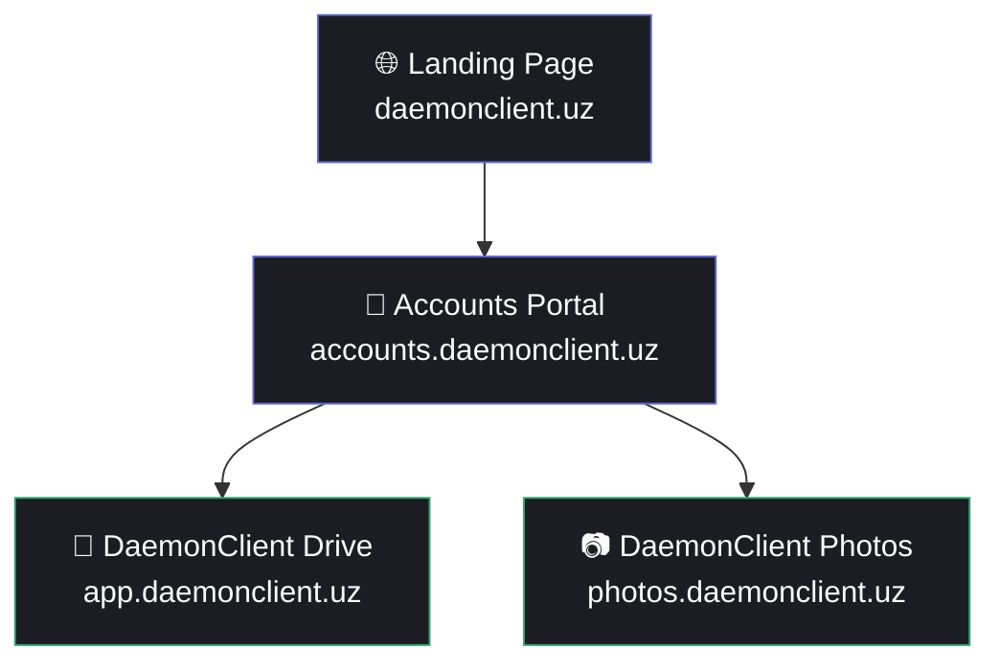
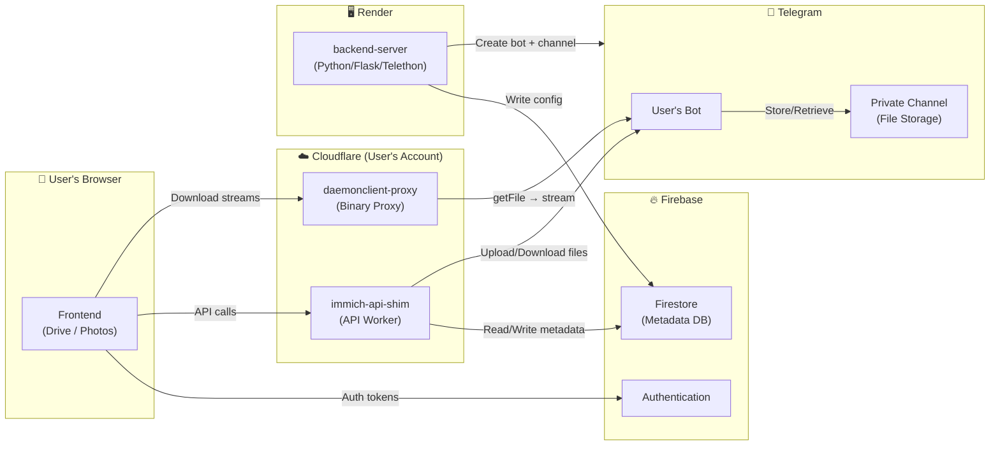
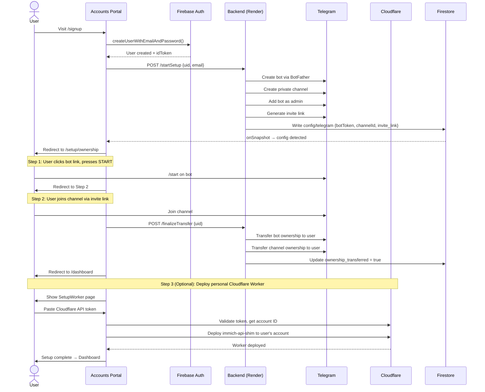
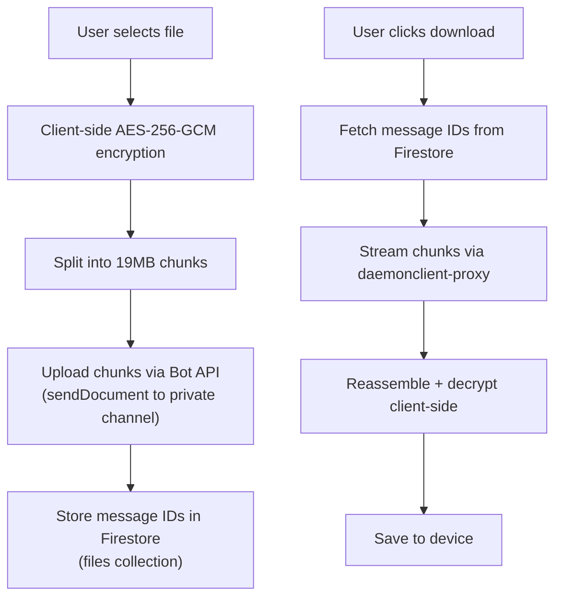

# DaemonClient — Project Bible

> **Your Files. Your Cloud. Your Control.**
> A zero-cost, zero-knowledge cloud platform that combines Telegram for storage and Cloudflare for compute.

---

## 1. Vision & Philosophy

DaemonClient solves a fundamental problem: **cloud storage is expensive and you don't own it.**

By leveraging two services that offer generous free tiers — **Telegram** (unlimited file storage via bots + channels) and **Cloudflare Workers** (100K requests/day free) — DaemonClient gives every user their own personal, encrypted, infinite cloud at **$0/month**.

### Core Principles

| Principle | Implementation |
|-----------|---------------|
| **Zero-Knowledge** | AES-256-GCM client-side encryption; servers never see plaintext |
| **Zero-Cost** | Telegram = free storage; Cloudflare = free compute; Firebase Spark = free auth/DB |
| **User Ownership** | Bot & channel ownership is cryptographically transferred to the user |
| **Decoupled** | Each service is independently deployable and replaceable |

---

## 2. Platform Services

DaemonClient currently offers **two user-facing services**, managed through a central **Accounts Portal**:



| Service | Description | URL | Tech Stack |
|---------|-------------|-----|------------|
| **DaemonClient Drive** | File storage with folders, encryption, ZIP downloads | `app.daemonclient.uz` | React 19, Vite, Tailwind, Firebase |
| **DaemonClient Photos** | Unlimited photo gallery (fork of Immich) | `photos.daemonclient.uz` | SvelteKit 5, @immich/ui, Tailwind |
| **Accounts Portal** | Central auth, onboarding, Telegram setup, Cloudflare worker deploy | `accounts.daemonclient.uz` | React 19, Vite, Tailwind, Framer Motion |

---

## 3. Complete Architecture

### 3.1 High-Level Data Flow



### 3.2 Service Inventory

Every folder in the monorepo and what it does:

| Folder | Role | Runtime | Deploy Target |
|--------|------|---------|---------------|
| `accounts-portal/` | User registration, Telegram setup wizard, Cloudflare worker deploy, profile/security management | Vite + React 19 | Firebase Hosting → `daemonclient-accounts` |
| `frontend/` | DaemonClient Drive — file upload/download/folder UI with encryption | Vite + React 19 | Firebase Hosting → `daemonclient-c0625` / `daemonclient-app` |
| `immich/web/` | DaemonClient Photos — SvelteKit photo gallery (forked Immich) | SvelteKit 5 | Firebase Hosting → `daemonclient-photos` |
| `landing-page/` | Marketing / splash page | Vite + React | Firebase Hosting (TBD) |
| `backend-server/` | Automated Telegram bot/channel creation + ownership transfer via Telethon userbots | Python Flask | Render.com (`daemonclient-elnj.onrender.com`) |
| `auth-worker/` | Session cookie management (create-session, logout, cookie validation) | Cloudflare Worker (TS) | `auth.daemonclient.uz` |
| `daemonclient-proxy/` | Binary file proxy — streams files from Telegram Bot API to browser | Cloudflare Worker (JS) | `daemonclient-proxy.sadrikov49.workers.dev` |
| `immich-api-shim/` | Translates Immich SDK API calls → Firestore + Telegram operations | Cloudflare Worker (TS) | Per-user deployment |
| `daemonclient-immich-bridge/` | Bridge between DaemonClient auth and Immich API shim | Cloudflare Worker (JS) | `daemonclient-immich-bridge.workers.dev` |
| `deployment-service/` | Deploys per-user Cloudflare Workers using their API tokens | Cloudflare Worker (TS) | `daemonclient-deployment.workers.dev` |
| `daemon-cli/` | CLI tool for power users (upload, download, list files) | Node.js CLI | npm (`daemonclient-cli`) |
| `daemonclient-desktop/` | Desktop app (Electron) — future | Electron | N/A (planned) |
| `functions/` | Firebase Cloud Functions (admin utilities, backfill scripts) | Node.js | Firebase Functions |
| `e2e-tests/` | End-to-end test suite | TBD | CI only |
| `docs/` | Setup guides, completion reports | Markdown | N/A |
| `scripts/` | Utility scripts | Various | Local |

---

## 4. Accounts Portal — The Onboarding Engine

The `accounts-portal` is the **central hub** where everything begins for a new user. It orchestrates a 3-step onboarding flow:

### 4.1 User Journey



### 4.2 Accounts Portal Pages

| Route | Component | Purpose |
|-------|-----------|---------|
| `/login` | `LoginPage` | Email/password sign-in, session creation via auth-worker |
| `/signup` | `SignupPage` | Account creation + triggers backend setup |
| `/setup` | `SetupPage` | Automated or manual Telegram bot/channel creation |
| `/setup/ownership` | `OwnershipPage` | 2-step bot START + channel join + ownership transfer → redirects to `/setup/worker` |
| `/setup/worker` | `SetupWorker` | Cloudflare API token input → validate → deploy per-user Worker + D1 database → redirects to `/dashboard` |
| `/dashboard` | `DashboardPage` | Service cards for Photos & Drive with live stats |
| `/profile` | `ProfilePage` | Display name, avatar color, read-only email |
| `/security` | `SecurityPage` | Password change + activity log |

### 4.3 Auth Architecture

```
accounts.daemonclient.uz (Accounts Portal)
         │
         │ POST /create-session {idToken, refreshToken}
         ▼
   auth.daemonclient.uz (Cloudflare Worker)
         │
         │ Sets HttpOnly cookie with session token
         │ Cookie domain: .daemonclient.uz (shared across subdomains)
         ▼
   app.daemonclient.uz / photos.daemonclient.uz
         │
         │ Cookie sent automatically on every request
         │ Worker validates session → extracts uid
         ▼
   Firestore (user-scoped data access)
```

---

## 5. DaemonClient Drive — How Files Flow



### Firestore Schema (Drive)

```
artifacts/default-daemon-client/users/{uid}/
├── config/
│   ├── telegram       → {botToken, botUsername, channelId, invite_link, ownership_transferred}
│   ├── zke            → {enabled, mode, password, salt}
│   └── photos_telegram → {botToken, botUsername, channelId}  (separate bot for photos)
├── files/
│   └── {fileId}       → {fileName, fileSize, fileType, parentId, type, messages[], uploadedAt}
├── profile/
│   └── settings       → {displayName, avatarColor, updatedAt}
├── activity/
│   └── {activityId}   → {type, timestamp, userAgent, ip}
└── services/
    ├── photos         → {totalAssets, lastAccessed}
    └── drive          → {totalFiles, lastAccessed}
```

---

## 6. DaemonClient Photos — Serverless Immich

The Photos service is a **decoupled fork of Immich** where the traditional Docker backend is replaced by:

| Immich Component | DaemonClient Replacement |
|-----------------|-------------------------|
| PostgreSQL | Firestore |
| Local disk / S3 | Telegram (via bot in private channel) |
| Node.js API server | Cloudflare Worker (`immich-api-shim`) |
| Immich mobile sync | Standard Immich mobile app → API shim intercepts |

### Key Technical Achievements

1. **Thumbhash blur-to-sharp** — Placeholder thumbnails from Firestore render instantly; hi-res loads lazily
2. **Paced request queue** — Global concurrency limiter (6 parallel, 80ms delay) prevents Telegram 429 errors
3. **Mobile upload normalization** — API shim detects single-file uploads and forces `sendPhoto` to generate Telegram thumbnails
4. **Debounced scroll loading** — Thumbnails only load when scrolling stops

---

## 7. Backend Server — The Provisioning Engine

The Python Flask server on Render.com is the most critical piece of the onboarding flow. It manages a **pool of Telethon userbots** stored in Firestore:

### Userbot Pool

```
Firestore: userbots/{botDocId}
├── api_id, api_hash, session_string
├── is_active: boolean
├── last_used: timestamp
├── status: "healthy" | "banned" | "error: ..."
└── error_count: number
```

### Endpoints

| Endpoint | Method | Purpose |
|----------|--------|---------|
| `/startSetup` | POST | Create bot + channel for new user |
| `/finalizeTransfer` | POST | Transfer bot & channel ownership |
| `/addPhotosBot` | POST | Add a separate bot for Photos service |
| `/api/list` | GET | List user's files (CLI) |
| `/api/delete` | POST | Delete file from registry (CLI) |
| `/api/config` | GET | Get bot token & channel ID (CLI) |
| `/api/zke-config` | GET | Get encryption config (CLI) |
| `/api/register` | POST | Register uploaded file metadata (CLI) |

---

## 8. Cloudflare Workers Topology

```
┌─────────────────────────────────────────────────────────────────┐
│                    Cloudflare Account (yours)                    │
│                                                                  │
│  ┌──────────────────┐  ┌──────────────────┐  ┌────────────────┐│
│  │  daemonclient-   │  │  daemonclient-   │  │  daemonclient- ││
│  │  auth             │  │  proxy           │  │  deployment    ││
│  │  ─────────────── │  │  ─────────────── │  │  ───────────── ││
│  │  Session mgmt    │  │  Binary streaming│  │  Deploy workers││
│  │  Cookie auth     │  │  Telegram → user │  │  to user accts ││
│  │  auth.daemon...  │  │                  │  │                ││
│  └──────────────────┘  └──────────────────┘  └────────────────┘│
│                                                                  │
│  ┌──────────────────┐  ┌──────────────────┐                     │
│  │  immich-api      │  │  daemonclient-   │                     │
│  │  (per-user)      │  │  immich-bridge   │                     │
│  │  ─────────────── │  │  ─────────────── │                     │
│  │  Immich SDK shim │  │  Auth bridge     │                     │
│  │  Firestore + TG  │  │                  │                     │
│  └──────────────────┘  └──────────────────┘                     │
└─────────────────────────────────────────────────────────────────┘
```

---

## 9. Firebase Hosting Topology

Configured in the root `firebase.json` and `.firebaserc`:

| Target | Firebase Site | Source | Domain |
|--------|--------------|--------|--------|
| `main` | `daemonclient-c0625` | `frontend/dist` | `daemonclient-c0625.web.app` |
| `app` | `daemonclient-app` | `frontend/dist` | `app.daemonclient.uz` |
| `photos` | `daemonclient-photos` | `immich/web/build` | `photos.daemonclient.uz` |
| `accounts` | `daemonclient-accounts` | `accounts-portal/dist` | `accounts.daemonclient.uz` |

---

## 10. Security Model

```
┌─────────────────────────────────────────────────────┐
│              Security Layers                         │
├─────────────────────────────────────────────────────┤
│                                                      │
│  Layer 1: AUTHENTICATION                             │
│  ├─ Firebase Auth (email/password)                   │
│  ├─ Session cookies (HttpOnly, Secure, SameSite)     │
│  └─ Auth worker validates on every request           │
│                                                      │
│  Layer 2: ENCRYPTION (Zero-Knowledge)                │
│  ├─ AES-256-GCM client-side encryption               │
│  ├─ PBKDF2 key derivation from user password         │
│  ├─ Keys exist in memory only — never persisted      │
│  └─ Server sees only encrypted noise                 │
│                                                      │
│  Layer 3: OWNERSHIP                                  │
│  ├─ Bot ownership transferred to user via BotFather  │
│  ├─ Channel ownership transferred via EditCreator    │
│  ├─ 2FA-protected transfer (Telethon + SRP)          │
│  └─ User can revoke bot access anytime               │
│                                                      │
│  Layer 4: ISOLATION                                  │
│  ├─ Per-user Cloudflare Workers (100K req/day each)  │
│  ├─ Per-user D1 databases                            │
│  ├─ User-scoped Firestore paths                      │
│  └─ No cross-user data access possible               │
│                                                      │
└─────────────────────────────────────────────────────┘
```

---

## 11. Deployment Commands

### Accounts Portal (UNPUBLISHED — needs deployment)

```bash
# Build
cd accounts-portal
npm install
npm run build          # → outputs to dist/

# Deploy to Firebase (from root)
cd ..
firebase deploy --only hosting:accounts
```

### Drive Frontend

```bash
cd frontend
npm install && npm run build
cd ..
firebase deploy --only hosting:main
# or for app.daemonclient.uz:
firebase deploy --only hosting:app
```

### Photos Frontend

```bash
cd immich/web
npm install && npm run build
cd ../..
firebase deploy --only hosting:photos
```

### Cloudflare Workers

```bash
# Auth Worker
cd auth-worker && npx wrangler deploy

# Proxy
cd daemonclient-proxy && npx wrangler deploy

# API Shim (template — deployed per-user by deployment-service)
cd immich-api-shim && npx wrangler deploy

# Deployment Service
cd deployment-service && npx wrangler deploy

# Immich Bridge
cd daemonclient-immich-bridge && npx wrangler deploy
```

### Backend Server

```bash
# Deployed on Render.com — push to main branch triggers auto-deploy
# Manual: Render Dashboard → daemonclient-elnj → Deploy
```

---

## 12. Environment Variables & Secrets

### Accounts Portal (`.env`)

| Variable | Purpose |
|----------|---------|
| `VITE_FIREBASE_API_KEY` | Firebase Web API key |
| `VITE_FIREBASE_AUTH_DOMAIN` | Firebase Auth domain |
| `VITE_FIREBASE_PROJECT_ID` | Firebase project ID (`daemonclient-c0625`) |
| `VITE_FIREBASE_*` | Remaining Firebase config values |

### Backend Server (`.env`)

| Variable | Purpose |
|----------|---------|
| `FIREBASE_CREDENTIALS_JSON` | Service account JSON for Firestore admin access |
| `TELETHON_2FA_PASSWORD` | 2FA password for userbot accounts |
| `ASSET_CHANNEL_ID` | Channel storing bot profile pictures |
| `BOT_PIC_MESSAGE_ID` | Message ID of the bot profile picture |

### Cloudflare Workers (Secrets)

| Worker | Secret | Purpose |
|--------|--------|---------|
| `auth-worker` | `SESSION_SECRET` | HMAC key for session cookies |
| `auth-worker` | `FIREBASE_API_KEY` | For token refresh |
| `immich-api-shim` | (vars in wrangler.toml) | Firebase config, Telegram proxy URL |

---

## 13. Current Status & What Needs Publishing

| Component | Status | Action Needed |
|-----------|--------|---------------|
| **accounts-portal** | ✅ Code complete | 🚀 **Build + deploy to Firebase** |
| **frontend (Drive)** | ✅ Deployed | None |
| **Photos (Immich)** | ✅ Deployed | None |
| **backend-server** | ✅ Running on Render | None |
| **auth-worker** | ✅ Deployed | None |
| **daemonclient-proxy** | ✅ Deployed | None |
| **immich-api-shim** | ✅ Template ready | Per-user deployment via deployment-service |
| **deployment-service** | ✅ Deployed | None |
| **landing-page** | 🔧 Incomplete | Needs design + deployment |
| **daemon-cli** | 🔧 Functional | Needs npm publish |
| **daemonclient-desktop** | 📋 Planned | Not started |

---

## 14. Domain Architecture

```
daemonclient.uz                  → Landing page
├── accounts.daemonclient.uz     → Accounts Portal (signup, setup, profile)
├── app.daemonclient.uz          → DaemonClient Drive
├── photos.daemonclient.uz       → DaemonClient Photos
└── auth.daemonclient.uz         → Auth Worker (session cookies)
```

---

## 15. Roadmap

### Completed ✅
- [x] Zero-knowledge encryption (AES-256-GCM)
- [x] Automated Telegram bot/channel provisioning
- [x] Ownership transfer (bot + channel)
- [x] Web dashboard with folder management
- [x] Photo gallery with timeline, thumbhash, paced loading
- [x] CLI tool for power users
- [x] Per-user Cloudflare Workers architecture
- [x] Accounts portal with full onboarding flow
- [x] Session-based cross-subdomain auth

### In Progress 🛠️
- [ ] Publish accounts-portal to Firebase
- [ ] Landing page redesign
- [ ] SetupWorker integration with deployment-service

### Planned 📋
- [ ] Desktop app with auto-sync folder (Electron)
- [ ] Mobile apps (iOS & Android)
- [ ] FUSE mount (virtual drive)
- [ ] Video playback optimization (20MB+ chunk streaming)
- [ ] Offline mode (Service Worker caching)

---

> *This document is the single source of truth for the DaemonClient project.*
> *Last updated: 2026-04-29*
